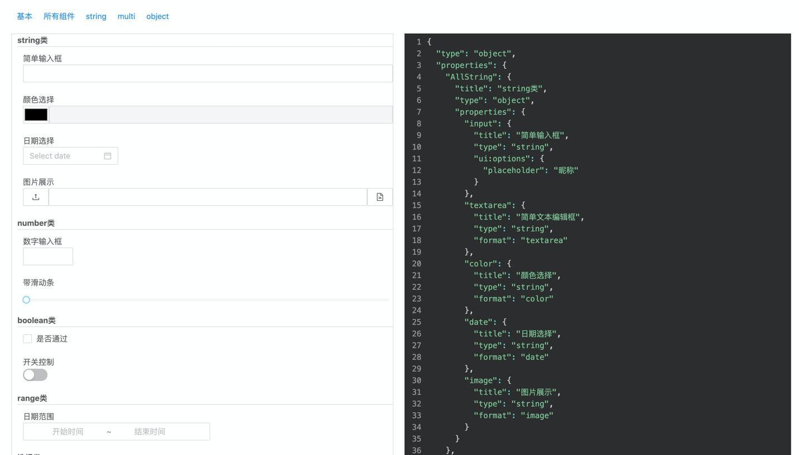

# vue-form-render
🚴 Base on Vue 3.x, Quickly generates custom form configuration interfaces using JSON Schema.
## examples

[form-render live Demo](https://muwoo.github.io/kaer-form-render/)



## usage

```vue
<template>
  <div>
    <formRender
      :schema="schema"
      :formData="formData"
      @on-change="change"
      @validate="validate"
    />
  </div>
</template>

<script>
import {reactive, toRefs} from 'vue';
import formRender from '../../packages/index.jsx';
export default {
  name: 'App',
  setup() {
    const state = reactive({
      schema: {
        type: 'object',
        properties: {
          string: {
            title: '字符串',
            type: 'string',
            maxLength: 4,
            'ui:options': {
              placeholder: '试着输入超过4个字符',
            },
          },
          select: {
            title: '单选',
            type: 'string',
            enum: ['a', 'b', 'c'],
            enumNames: ['选项1', '选项2', '选项3'],
          },
        },
      },
      formData: {
        string: 'aaa'
      },
    });

    const change = (v) => {
      state.formData = v;
      console.log(v);
    }
    const validate = (v) => {
      console.log(v);
    }

    return {
      ...toRefs(state),
      change,
      validate,
    }
  },
  components: {
    formRender,
  }
}
</script>

```
